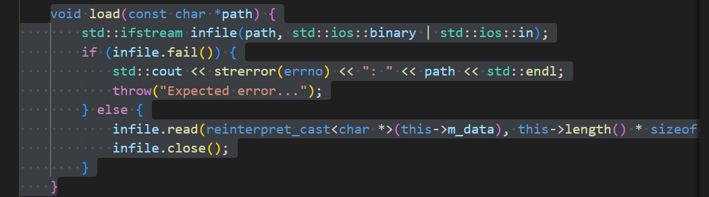

# Tinychat workflow

本文详细解释Tinychat项目的workflow

## 基础数据结构 Matrix3D：
Matrix3D代码在transformer/include/common.h中，该类用一个T* m_data代表数据，并有这个3D矩阵的维度：

值得关注的是load()方法：

可以看出, load()把char *path路径的文件通过mmap方式，读取
this->length()到this->m_data中。

## 模型的表征
模型参数导入部分在在tinychat-tutorial/transformer/application/chat.cc中。

可以看出，LLaMA7B模型由一个Int4LlamaForCausalLM的C++类表示，定义如下：
。

## Int4LlamaForCausalLM详解

### 构造函数
模型接受一个string参数，和一个model_config结构体作为参数。

### model_config-模型架构的表征
model_config结构体定义如下(transformer/include/model.h)：
。

具体到llama 7B，则是这样的：

这代表LLaMA 7B在decode阶段支持一个request的batching，
attention机制有32个head，一共有32层计算，模型最大支持2048
上下文，每个词向量为4096维，hidden_dim为11008(具体含义待解)， 共支持32k个token，量化的
group_size为1。

### forward()方法
forward()方法实现模型的前向计算。返回一个Int4LlamaForCausalLM_output
结构体。

为了弄清楚forward()方法，我们看看他的返回值：Int4LlamaForCausalLM_output。
。

可以看出，Int4LlamaForCausalLM_output由两部分组成：
一个由Matrix3D代表的 logits值，和std::vector<Matrix3D>代表的
KV Cache。

此函数的实现在tinychat-tutorial/transformer/src/nn_modules/Int4llamaForCausalLM.cc中。

